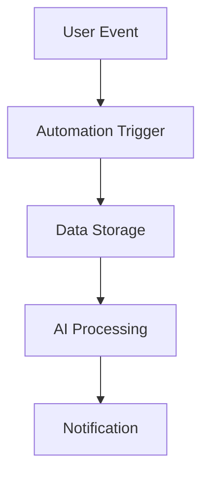
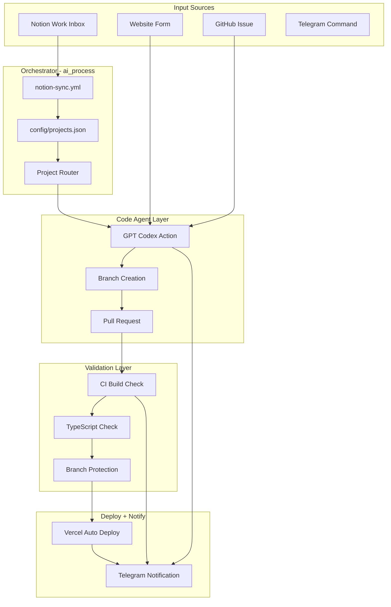
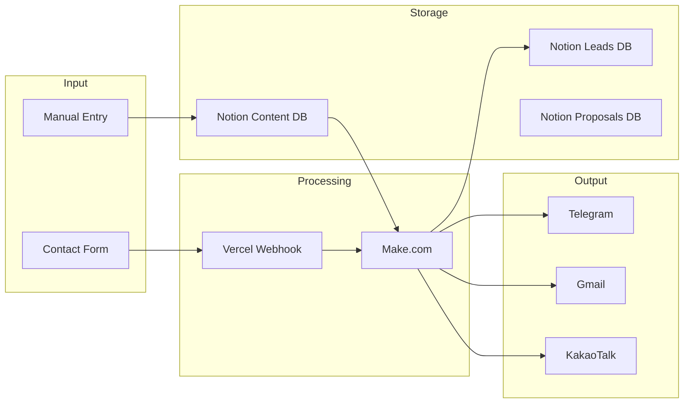

# AI Process Architecture Diagram

## Generic Automation Flow

```mermaid
flowchart TB
    UserEvent["User Event"] --> Trigger["Automation Trigger"]
    Trigger --> Storage["Data Storage"]
    Storage --> AI["AI Processing"]
    AI --> Notification["Notification"]
```

## Detailed Architecture

```mermaid
flowchart TB
    subgraph input ["Input Sources"]
        NotionInbox["Notion Work Inbox"]
        WebForm["Website Form"]
        GitHubIssue["GitHub Issue"]
        TelegramCmd["Telegram Command"]
    end

    subgraph orchestrator ["Orchestrator - ai_process"]
        NotionSync["notion-sync.yml"]
        ProjectRouter["Project Router"]
        ProjectsJSON["config/projects.json"]
    end

    subgraph codeAgent ["Code Agent Layer"]
        CodexAction["GPT Codex Action"]
        BranchCreate["Branch Creation"]
        PRCreate["Pull Request"]
    end

    subgraph validation ["Validation Layer"]
        CI["CI Build Check"]
        TypeCheck["TypeScript Check"]
        BranchProtect["Branch Protection"]
    end

    subgraph deploy ["Deploy + Notify"]
        Vercel["Vercel Auto Deploy"]
        Telegram["Telegram Notification"]
    end

    NotionInbox --> NotionSync
    NotionSync --> ProjectsJSON
    ProjectsJSON --> ProjectRouter

    ProjectRouter --> CodexAction
    WebForm --> CodexAction
    GitHubIssue --> CodexAction

    CodexAction --> BranchCreate
    BranchCreate --> PRCreate

    PRCreate --> CI
    CI --> TypeCheck
    TypeCheck --> BranchProtect

    BranchProtect --> Vercel
    Vercel --> Telegram

    CodexAction --> Telegram
    CI --> Telegram
```

## Business Automation Flow

```mermaid
flowchart LR
    subgraph input ["Input"]
        Form["Contact Form"]
        Manual["Manual Entry"]
    end

    subgraph process ["Processing"]
        Webhook["Vercel Webhook"]
        MakeCom["Make.com"]
    end

    subgraph store ["Storage"]
        Leads["Notion Leads DB"]
        Content["Notion Content DB"]
        Proposals["Notion Proposals DB"]
    end

    subgraph output ["Output"]
        TelegramOut["Telegram"]
        EmailOut["Gmail"]
        KakaoOut["KakaoTalk"]
    end

    Form --> Webhook
    Webhook --> MakeCom
    Manual --> Content

    MakeCom --> Leads
    MakeCom --> TelegramOut
    MakeCom --> EmailOut

    Content --> MakeCom
    MakeCom --> KakaoOut
```
