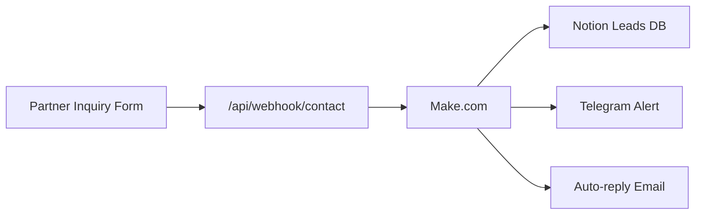
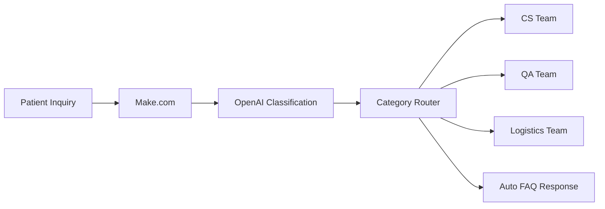
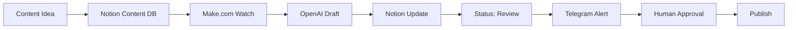
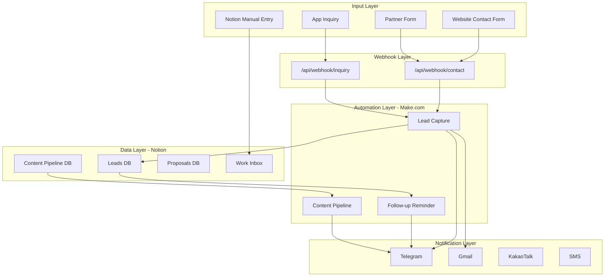

# Healthcare Automation Architecture Diagram

## B2B Partner Flow

```mermaid
flowchart LR
    PartnerForm["Partner Inquiry Form"] --> Webhook["/api/webhook/contact"]
    Webhook --> MakeCom["Make.com"]
    MakeCom --> NotionLeads["Notion Leads DB"]
    MakeCom --> Telegram["Telegram Alert"]
    MakeCom --> Gmail["Auto-reply Email"]
```

## B2C Patient Flow

```mermaid
flowchart LR
    PatientInquiry["Patient Inquiry"] --> MakeCom["Make.com"]
    MakeCom --> OpenAI["OpenAI Classification"]
    OpenAI --> Router["Category Router"]
    Router --> CS["CS Team"]
    Router --> QA["QA Team"]
    Router --> Logistics["Logistics Team"]
    Router --> FAQ["Auto FAQ Response"]
```

## Content Pipeline

```mermaid
flowchart LR
    Idea["Content Idea"] --> NotionContent["Notion Content DB"]
    NotionContent --> Watch["Make.com Watch"]
    Watch --> AI["OpenAI Draft"]
    AI --> Update["Notion Update"]
    Update --> Review["Status: Review"]
    Review --> Telegram["Telegram Alert"]
    Telegram --> Approve["Human Approval"]
    Approve --> Publish["Publish"]
```

## Full Architecture

```mermaid
flowchart TB
    subgraph input ["Input Layer"]
        WebForm["Website Contact Form"]
        AppInquiry["App Inquiry"]
        PartnerForm["Partner Form"]
        NotionManual["Notion Manual Entry"]
    end

    subgraph webhook ["Webhook Layer"]
        ContactAPI["/api/webhook/contact"]
        InquiryAPI["/api/webhook/inquiry"]
    end

    subgraph automation ["Automation Layer - Make.com"]
        LeadCapture["Lead Capture"]
        FollowUp["Follow-up Reminder"]
        ContentPipe["Content Pipeline"]
    end

    subgraph data ["Data Layer - Notion"]
        LeadsDB["Leads DB"]
        ContentDB["Content Pipeline DB"]
        ProposalsDB["Proposals DB"]
        WorkInbox["Work Inbox"]
    end

    subgraph notify ["Notification Layer"]
        TelegramBot["Telegram"]
        Email["Gmail"]
        Kakao["KakaoTalk"]
        SMS["SMS"]
    end

    WebForm --> ContactAPI
    AppInquiry --> InquiryAPI
    PartnerForm --> ContactAPI
    NotionManual --> WorkInbox

    ContactAPI --> LeadCapture
    InquiryAPI --> LeadCapture
    LeadCapture --> LeadsDB
    LeadCapture --> TelegramBot
    LeadCapture --> Email

    LeadsDB --> FollowUp
    FollowUp --> TelegramBot

    ContentDB --> ContentPipe
    ContentPipe --> TelegramBot
```
