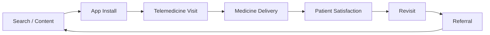
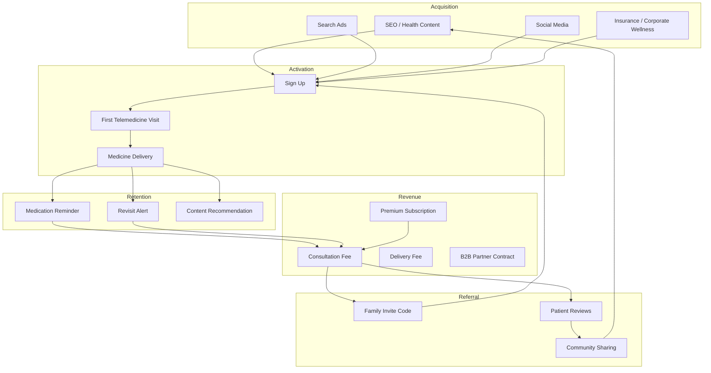

# Healthcare Growth Loop Diagram

## User Growth Loop

```mermaid
flowchart LR
    Search["Search / Content"] --> Install["App Install"]
    Install --> Visit["Telemedicine Visit"]
    Visit --> Delivery["Medicine Delivery"]
    Delivery --> Satisfaction["Patient Satisfaction"]
    Satisfaction --> Revisit["Revisit"]
    Revisit --> Referral["Referral"]
    Referral --> Search
```

## AARRR Funnel

```mermaid
flowchart TB
    subgraph acquisition ["Acquisition"]
        SEO["SEO / Health Content"]
        Ads["Search Ads"]
        SNS["Social Media"]
        Partners["Insurance / Corporate Wellness"]
    end

    subgraph activation ["Activation"]
        Signup["Sign Up"]
        FirstVisit["First Telemedicine Visit"]
        MedDelivery["Medicine Delivery"]
    end

    subgraph retention ["Retention"]
        MedReminder["Medication Reminder"]
        RevisitAlert["Revisit Alert"]
        ContentRec["Content Recommendation"]
    end

    subgraph revenue ["Revenue"]
        ConsultFee["Consultation Fee"]
        DeliveryFee["Delivery Fee"]
        Subscription["Premium Subscription"]
        B2BContract["B2B Partner Contract"]
    end

    subgraph referral ["Referral"]
        FamilyInvite["Family Invite Code"]
        Reviews["Patient Reviews"]
        Community["Community Sharing"]
    end

    SEO --> Signup
    Ads --> Signup
    SNS --> Signup
    Partners --> Signup

    Signup --> FirstVisit
    FirstVisit --> MedDelivery

    MedDelivery --> MedReminder
    MedDelivery --> RevisitAlert
    MedDelivery --> ContentRec

    MedReminder --> ConsultFee
    RevisitAlert --> ConsultFee
    Subscription --> ConsultFee

    ConsultFee --> FamilyInvite
    ConsultFee --> Reviews
    Reviews --> Community

    Community --> SEO
    FamilyInvite --> Signup
```
