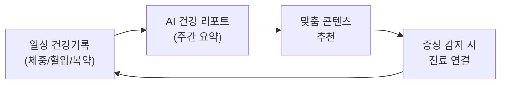
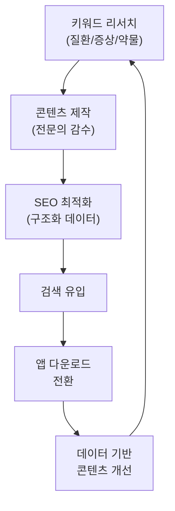

# 솔루션 방향 — Growth Marketing 관점 개선안

> 비대면 진료 플랫폼의 성장을 위한 구조적 개선 방향

---

## 닥터나우 개선 방향

### Solution 1: 건강관리 리텐션 루프 구축

**목표:** 비진료 시점 DAU 확보 → LTV 증가



| 기능 | 설명 | 기대 효과 |
|---|---|---|
| 건강 데이터 기록 | 체중, 혈압, 복약 알림 | DAU +30% |
| AI 주간 리포트 | 기록 기반 건강 트렌드 | 리텐션 D7 +20% |
| 리워드 시스템 | 기록 → 포인트 → 진료비 할인 | LTV +25% |

**참고:** 나만의닥터의 닥터캐시 모델이 좋은 레퍼런스. 다만 닥터나우는 콘텐츠 자산과 결합하면 더 강력한 루프 가능.

---

### Solution 2: 비급여 가격 비교 SEO 랜딩

**목표:** "탈모약 가격", "여드름 진료비" 등 고전환 키워드 유입

| 페이지 유형 | 예시 | SEO 타겟 |
|---|---|---|
| 진료비 비교 | `/price/탈모` | "탈모약 가격 비교" |
| 시술 가격 | `/price/보톡스` | "보톡스 가격" |
| 지역별 | `/price/강남/탈모` | "강남 탈모 병원 가격" |

닥터나우의 콘텐츠 SEO 역량 + 가격 데이터 결합 시 나만의닥터 대비 차별화.

---

## 나만의닥터 개선 방향

### Solution 1: 콘텐츠 SEO 파이프라인 구축

**목표:** 오가닉 검색 유입 10배 확대



**Phase 1 (1~3개월):**
- 상위 100개 건강 키워드 타겟 콘텐츠 제작
- 진료과별 전용 랜딩 페이지 30개 구축
- FAQ 구조화 데이터 적용

**Phase 2 (3~6개월):**
- 의약품 사전, 질환백과 콘텐츠 확장
- UGC (사용자 후기, Q&A) 웹 노출
- 지역별 병원 정보 페이지

---

### Solution 2: 웹 전환 최적화

**목표:** 웹 방문 → 앱 설치 전환율 개선

| 현재 | 개선 방향 |
|---|---|
| 단일 랜딩 → "앱 다운로드" | 증상별 랜딩 → 가치 제공 → 앱 CTA |
| 정보 없이 앱 유도 | 웹에서 의사 프로필, 후기, 가격 확인 → 앱 진료 |
| 범용 CTA | 맞춤 CTA ("지금 바로 탈모 진료 시작") |

**기대 효과:** 웹→앱 전환율 2~3배 개선

---

### Solution 3: 실시간 상담 / UGC 도입

**목표:** 검색 유입 + 신뢰 구축 + 전환의 삼중 효과

닥터나우의 "실시간 의료 상담" 섹션은:
- 사용자가 직접 질문 → SEO 롱테일 키워드 자동 생성
- 전문의 답변 → 신뢰 구축
- 답변 페이지에서 진료 CTA → 전환

이 모델을 나만의닥터에 도입하면 현재 부족한 콘텐츠 자산을 사용자 참여로 해결 가능.

---

## 양사 공통 개선안

### 구조화 데이터 & Rich Results

```json
{
  "@context": "https://schema.org",
  "@type": "MedicalOrganization",
  "name": "서비스명",
  "medicalSpecialty": ["Dermatology", "InternalMedicine", ...],
  "availableService": {
    "@type": "MedicalProcedure",
    "name": "비대면 진료",
    "procedureType": "Telemedicine"
  }
}
```

Google Health Panel, FAQ Rich Results, HowTo Rich Results 노출 가능.

### 퍼포먼스 마케팅 인프라

| 요소 | 현재 | 권장 |
|---|---|---|
| 랜딩 페이지 | 범용 홈 | 증상별/진료과별 전용 랜딩 |
| A/B 테스트 | 미확인 | 랜딩 페이지별 CTA/카피 테스트 |
| UTM 추적 | 미확인 | 채널별/캠페인별 UTM 체계 |
| 전환 추적 | 미확인 | 앱 설치 → 첫 진료 이벤트 추적 |

---

## 요약 — 핵심 기회 우선순위

### 닥터나우

| 순위 | 기회 | Impact | Effort |
|---|---|---|---|
| 1 | 건강관리 리텐션 루프 | ★★★★★ | ★★★★☆ |
| 2 | 비급여 가격 비교 | ★★★★☆ | ★★★☆☆ |
| 3 | B2B 제휴 마케팅 강화 | ★★★☆☆ | ★★☆☆☆ |

### 나만의닥터

| 순위 | 기회 | Impact | Effort |
|---|---|---|---|
| 1 | SEO 콘텐츠 파이프라인 | ★★★★★ | ★★★★☆ |
| 2 | 웹 전환 최적화 | ★★★★☆ | ★★★☆☆ |
| 3 | UGC/실시간 상담 | ★★★★☆ | ★★★★☆ |

---

*이 분석은 공개된 웹사이트 구조를 기반으로 작성되었습니다. 실제 구현 시 내부 데이터 검증이 필요합니다.*
