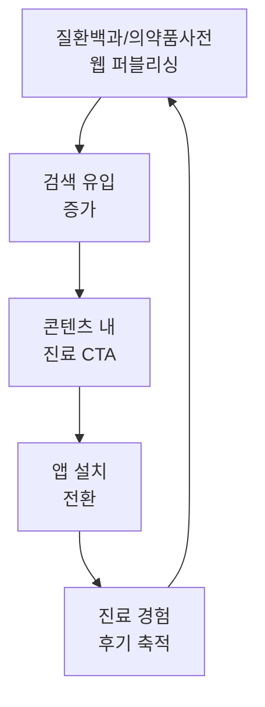
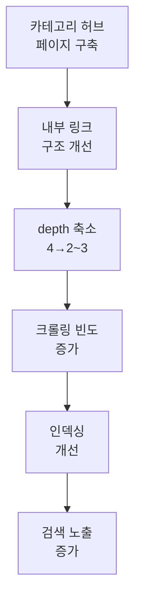

# 솔루션 방향 — Growth Marketing 관점 개선안

> WebScout 크롤링 데이터 기반 (2026-03-12)

---

## 닥터나우 개선 방향

### Solution 1: 웹 콘텐츠 SEO 확대

**목표:** 사이트맵 31 pages → 수천 pages, 웹 자연 유입 10배 확대



| Phase | 액션 | 기대 효과 |
|---|---|---|
| 1 (1~3M) | 질환백과·의약품사전 웹 노출 (앱 내 콘텐츠를 웹에도 퍼블리싱) | 키워드 커버리지 확대 |
| 2 (3~6M) | 진료비 비교 페이지 구축 (나만의닥터 `/medical-cost` 벤치마크) | 가격 검색 유입 확보 |
| 3 (6~12M) | 실시간 Q&A 웹 노출 + UGC SEO | 롱테일 키워드 자동 생성 |

**참고:** 나만의닥터는 이미 `/medical-cost`만 14,964 페이지를 운영 중. 닥터나우도 앱 내부에 이미 보유한 콘텐츠를 웹에 노출하는 것만으로 빠르게 따라잡을 수 있음.

---

### Solution 2: 전환 경로 최적화

**목표:** 웹 방문 → 앱 설치 전환율 2~3배 개선

| 현재 | 개선 방향 |
|---|---|
| 전환 페이지 depth 3 | depth 1로 접근성 개선 |
| 범용 홈 → "앱 다운로드" | 증상별 랜딩 → 가치 제공 → 앱 CTA |
| 후기 홈에만 노출 | 모든 콘텐츠 페이지에 관련 후기 삽입 |

---

### Solution 3: 후기·UGC의 SEO 자산화

**목표:** 25만+ 후기를 검색엔진에서 발견 가능한 자산으로 전환

- 후기 개별 페이지 생성 → Review 구조화 데이터 적용
- "닥터나우 후기", "비대면 진료 후기" 키워드 점유
- 실시간 Q&A를 웹에서도 볼 수 있도록 → FAQ 구조화 데이터

---

## 나만의닥터 개선 방향

### Solution 1: 콘텐츠 접근성 개선

**목표:** depth 4+ 페이지 4,884개의 접근성 확보



| 액션 | 대상 | 기대 효과 |
|---|---|---|
| `/healthLab` 카테고리 허브 | FAQ 4,887 pages | depth 4 → 2~3 |
| `/medical-cost` 지역별 허브 | 진료비 14,964 pages | 내부 링크 강화 |
| 사이트맵 분할 | 19,934 URLs | 검색엔진 크롤링 효율 |

---

### Solution 2: 사회적 증거 도입

**목표:** 신뢰 구축 → 전환율 향상

| 현재 | 개선 방향 |
|---|---|
| 후기 미노출 | 앱 후기를 웹에 노출 + 캐러셀 |
| 숫자만 제시 ("50만명") | 구체적 후기 + 별점 |
| 구조화 데이터 없음 | AggregateRating, Review 스키마 |

닥터나우의 후기 활용 전략을 벤치마크할 필요가 있음.

---

### Solution 3: 콘텐츠 → 전환 퍼널 강화

**목표:** 대규모 유입 트래픽의 전환율 개선

| 콘텐츠 유형 | 현재 CTA | 개선 CTA |
|---|---|---|
| 진료비 비교 | "앱 다운로드" (범용) | "이 병원에서 바로 진료 예약" (맞춤) |
| 건강 FAQ | CTA 약함 | "이 증상으로 비대면 진료 받기" |
| 이벤트 페이지 | 앱 유도 | 딥링크로 앱 내 해당 화면 직행 |

---

## 양사 공통 개선안

### 구조화 데이터 & Rich Results

```json
{
  "@context": "https://schema.org",
  "@type": "MedicalOrganization",
  "name": "서비스명",
  "medicalSpecialty": ["Dermatology", "InternalMedicine"],
  "availableService": {
    "@type": "MedicalProcedure",
    "name": "비대면 진료",
    "procedureType": "Telemedicine"
  },
  "aggregateRating": {
    "@type": "AggregateRating",
    "ratingValue": "4.8",
    "reviewCount": "250000"
  }
}
```

### 퍼포먼스 마케팅 인프라

| 요소 | 현재 | 권장 |
|---|---|---|
| 랜딩 페이지 | 범용 홈 | 증상별/진료과별 전용 랜딩 |
| A/B 테스트 | 미확인 | 랜딩 페이지별 CTA/카피 테스트 |
| UTM 추적 | 미확인 | 채널별/캠페인별 UTM 체계 |
| 전환 추적 | 미확인 | 앱 설치 → 첫 진료 이벤트 추적 |

---

## 요약 — 핵심 기회 우선순위

### 닥터나우

| 순위 | 기회 | Impact | Effort |
|---|---|---|---|
| 1 | 웹 콘텐츠 SEO 확대 (앱 콘텐츠 웹 퍼블리싱) | ★★★★★ | ★★★☆☆ |
| 2 | 전환 경로 최적화 (depth 개선, 맞춤 CTA) | ★★★★☆ | ★★☆☆☆ |
| 3 | 후기·UGC SEO 자산화 | ★★★★☆ | ★★★☆☆ |

### 나만의닥터

| 순위 | 기회 | Impact | Effort |
|---|---|---|---|
| 1 | 콘텐츠 접근성 개선 (depth 축소, 허브 구축) | ★★★★★ | ★★★☆☆ |
| 2 | 사회적 증거 도입 (후기, 리뷰, 별점) | ★★★★☆ | ★★☆☆☆ |
| 3 | 콘텐츠→전환 퍼널 강화 (맞춤 CTA, 딥링크) | ★★★★☆ | ★★★☆☆ |

---

*WebScout 크롤링 데이터 기반. 실제 구현 시 내부 데이터 검증이 필요합니다.*
