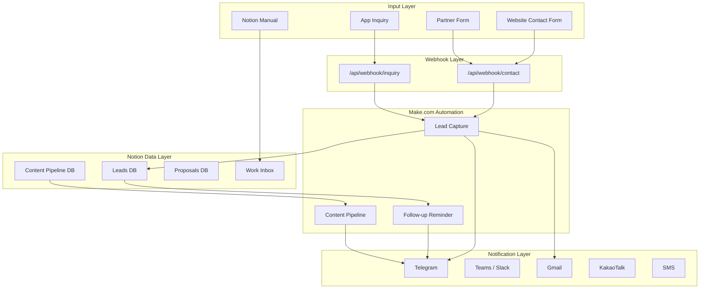
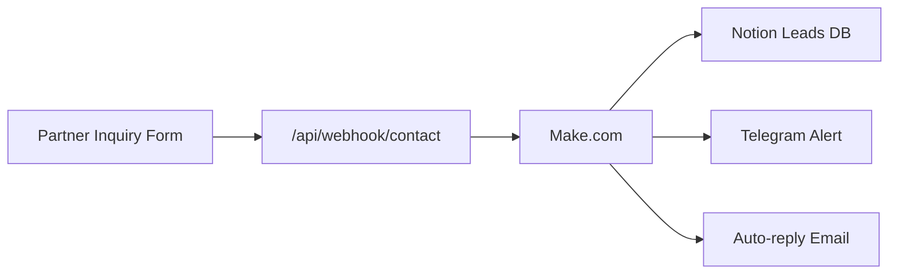
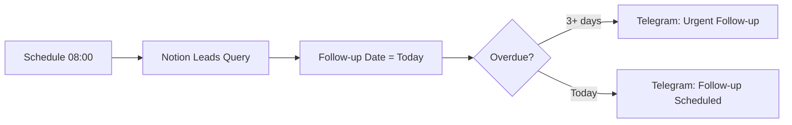
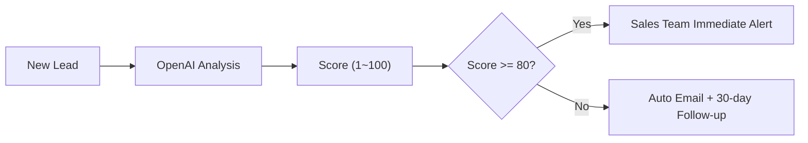
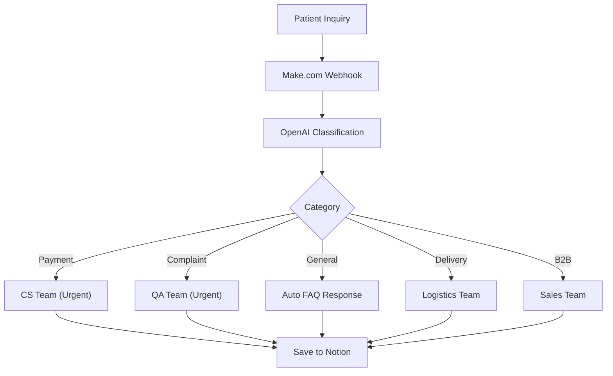
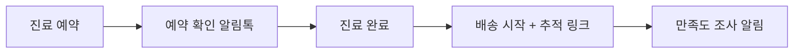
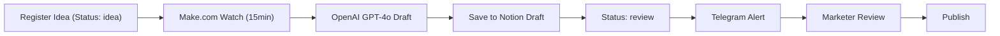
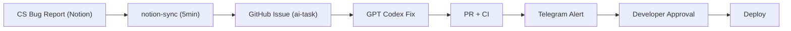
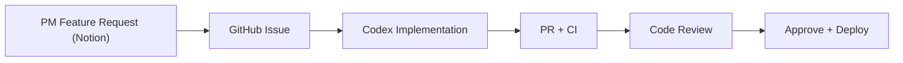

# Healthcare AI Automation Architecture

헬스케어 플랫폼의 자동화 기술 구조.

---

## 전체 구조

---

## B2B: 파트너 영업 자동화

### 리드 캡처

Notion Leads DB 필드: Name(병원명), Type(b2b), Source(partner-page), Status(new)

### 팔로업 자동화

### 리드 스코어링 (향후)

---

## B2C: 환자 문의 자동화

### AI 자동 분류

### 환자 여정 자동 알림

---

## 콘텐츠 생산 자동화

### 파이프라인

### 콘텐츠 유형별 프롬프트

| 유형 | 길이 | 톤 |
|------|------|-----|
| blog | 1000~1500자 | 전문적이면서 친근한 |
| sns-post | 200~300자 | 캐주얼, 이모지 활용 |
| newsletter | 500~800자 | 정보 전달, 구조화 |
| landing-page | 300~500자 | 설득력, CTA 포함 |

---

## 내부 개발 자동화

### 버그 수정

### 기능 요청

---

## 환경변수 요약

| 변수 | 용도 | 위치 |
|------|------|------|
| `MAKE_CONTACT_WEBHOOK_URL` | 문의폼 → Make.com | Vercel |
| `MAKE_INQUIRY_WEBHOOK_URL` | 고객문의 → Make.com | Vercel |
| `WEBHOOK_API_KEY` | webhook 인증 | Vercel |
| `ALLOWED_ORIGINS` | CORS 화이트리스트 | Vercel |
| `NOTION_TOKEN` | Notion API 접근 | GitHub Secrets |
| `GH_PAT` | Cross-repo 접근 | GitHub Secrets |
| `TELEGRAM_BOT_TOKEN` | Telegram 알림 | GitHub Secrets + Make.com |
| `OPENAI_API_KEY` | AI 콘텐츠 생성, Codex | GitHub Secrets + Make.com |
