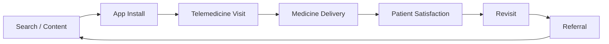
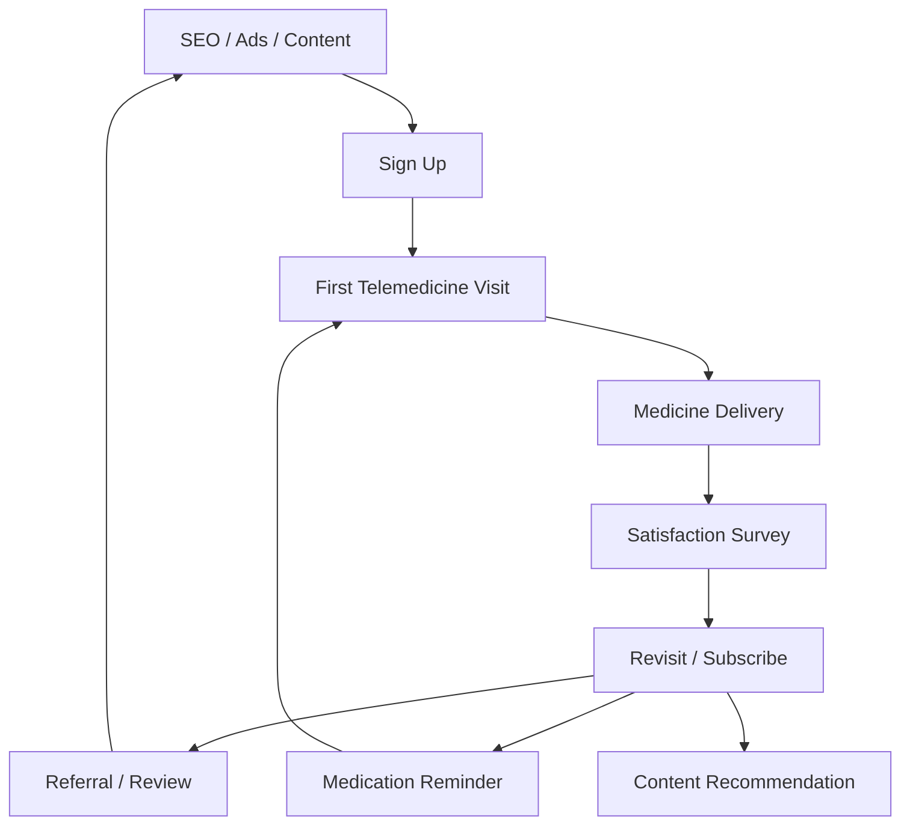

# Healthcare Growth Loop

비대면 진료 플랫폼의 AARRR 기반 성장 구조.

---

## User Growth Loop



---

## 1. Acquisition (유입)

사용자를 플랫폼으로 끌어오는 단계.

### 유입 채널

| 채널 | 전략 | 자동화 |
|------|------|--------|
| SEO | 건강 콘텐츠 (증상별 가이드) | Content Pipeline → AI 초안 생성 |
| 검색 광고 | 증상 키워드 타겟팅 | 리드 캡처 → CRM 자동 저장 |
| SNS | 건강 팁, 인포그래픽 | Content Pipeline → 플랫폼별 초안 |
| 제휴 | 보험사, 기업 복지 | 제휴 문의 → Leads DB 자동 등록 |

### 핵심 지표

- 월 방문자 수 (MAU)
- 채널별 유입 비율
- 콘텐츠 클릭률 (CTR)
- 회원가입 전환율

### AI 자동화 적용

```
Content Pipeline DB에 아이디어 등록
    → AI가 시즌별 건강 콘텐츠 초안 생성
    → 검토 후 게시
    → SEO 유입 증가
```

시즌별 콘텐츠 전략:

| 시즌 | 키워드 | 콘텐츠 |
|------|--------|--------|
| 봄 (3~5월) | 알레르기, 비염 | 비대면 진료로 봄철 알레르기 관리하기 |
| 여름 (6~8월) | 피부, 여름감기 | 여름철 피부 트러블, 비대면으로 해결 |
| 가을 (9~11월) | 독감, 건강검진 | 독감 시즌 비대면 진료 가이드 |
| 겨울 (12~2월) | 감기, 면역력 | 겨울 감기 비대면 진료 완전 가이드 |

---

## 2. Activation (활성화)

첫 진료 경험을 최적화하는 단계.

### 핵심 경험

| 단계 | 목표 | 자동화 |
|------|------|--------|
| 진료 예약 | 3클릭 이내 완료 | UX 최적화 |
| 대기 시간 | 5분 이내 | 실시간 매칭 알고리즘 |
| 진료 | 친절하고 정확한 진료 | 의사 평점 시스템 |
| 약 배송 | 당일 도착 | 배송 상태 자동 알림 |
| 진료 후 | 관리 안내 | 자동 안내 메시지 (카카오/SMS) |

### 핵심 지표

- 첫 진료 완료율
- 예약 → 진료 이탈률
- 약 배송 만족도
- 첫 진료 후 재진료율 (7일 이내)

### AI 자동화 적용

```
진료 완료
    → 자동 만족도 조사 (카카오 알림톡)
    → 불만족 응답 시 CS팀 즉시 알림
    → 만족 응답 시 리뷰 요청
```

---

## 3. Retention (재방문)

사용자를 지속적으로 재방문시키는 단계.

### 재방문 트리거

| 트리거 | 방법 | 자동화 |
|--------|------|--------|
| 복약 알림 | 처방 기간 기반 알림 | Schedule → 카카오/SMS |
| 재진료 리마인더 | 만성질환 정기 진료 | Follow-up Date → Telegram/카카오 |
| 건강 콘텐츠 | 관심 증상 기반 추천 | AI 콘텐츠 매칭 |
| 계절 알림 | 시즌별 건강 관리 | Schedule → 대상자 필터 → 알림 |
| 건강검진 안내 | 연 1회 검진 리마인더 | 생년월일 기반 스케줄 |

### 핵심 지표

- 월 재방문율 (MAU/총 회원)
- 재진료율 (30일 이내)
- 복약 완료율
- 평균 진료 횟수/년

### AI 자동화 적용

```
Schedule (매일 09:00)
    → Notion에서 Follow-up Date = 오늘인 환자 조회
    → 카카오 알림톡: "정기 진료 예정일입니다"
    → 미예약 시 3일 후 리마인더
```

---

## 4. Revenue (수익)

사용자로부터 수익을 창출하는 단계.

### 수익 모델

| 모델 | 설명 |
|------|------|
| 진료비 | 비대면 진료 수수료 |
| 약 배송비 | 배송 수수료 |
| 프리미엄 구독 | 월정액 건강관리 서비스 |
| B2B 제휴 | 병원 파트너 수수료, 기업 복지 계약 |
| 광고 | 건강 상품 광고, 병원 광고 |

### AI 자동화 적용

```
B2B 제휴 문의
    → Leads DB 자동 저장 (Score 자동 산정)
    → 고가치 리드: 영업팀 즉시 알림
    → 저가치 리드: 자동 이메일 + 팔로업 스케줄
```

---

## 5. Referral (추천)

기존 사용자가 새 사용자를 데려오는 단계.

### 추천 채널

| 채널 | 방법 | 자동화 |
|------|------|--------|
| 가족 추천 | 진료 후 가족 초대 코드 | 진료 완료 → 자동 초대 링크 |
| 리뷰 | 만족도 높은 사용자에게 리뷰 요청 | NPS 8+ → 리뷰 요청 알림 |
| 커뮤니티 | 건강 커뮤니티 활동 | 콘텐츠 공유 기능 |
| 기업 복지 | 직원 가입 유도 | B2B 계약 → 직원 초대 자동화 |

### 핵심 지표

- 추천 코드 사용률
- 바이럴 계수 (K-factor)
- 리뷰 작성률
- NPS (Net Promoter Score)

---

## Growth Loop 전체 맵


